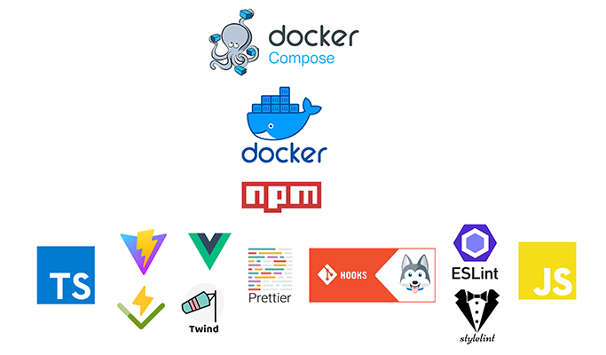

  

### Требования

- `npm i -g lint-staged`

### Установка

- `git clone <url> -b <branch-name>`
- `npm i && npm run prepare`

### Запуск

- `npm run dev` (`http://localhost:4444`)

### Docker

Docker использует nginx, поэтому если необходимо изменить порт который будет слушать Docker в nginx, то:

- Необходимо поправить порт в `docker/production/nginx.conf` (`server.listen <port>`) на необходимый;
- Поправить порт в `docker/production/Dockerfile` (`ENV PORT <port>`) на необходимый;
- Поправить порт в `docker/production/docker-compose.yml` на необходимый;

#### Docker compose dev (hot reload)

- `docker-compose -f docker/development/docker-compose.yml up --build` - старт (`http://localhost:4445`)
- `docker-compose -f docker/development/docker-compose.yml down` - стоп

#### Docker compose

- `docker-compose -f docker/production/docker-compose.yml up --build -d` - старт (`http://localhost:80`)
- `docker-compose -f docker/production/docker-compose.yml down` - стоп

### История инициализации

- `npm create vite@latest vue-xzdwq -- --template vue-ts`

### Добавить новый язык перевода

1. В `src\lang\translation\` создать `.yml` файл с именем формата ISO language code (например `ru.yml`);
2. Сделать перевод в этом файле по аналогичным ключам из ранее добавленных языков;
3. В `src\lang\available-languages.yml` зарегистрировать формат и наименование языка;
4. В папку `src\assets\img\flags\` поместить `.png` изображение флага страны где зарегистрирован язык с именем как и
   ранее добавленный `.yml` файл (например `ru.png`);
5. Скопировать файл `.mjs` с аналогичным именем (например `ru.mjs`) из `node_modules\quasar\lang\` в папку
   `src\lang\quasar\`;

Копирование из Quasar модуля в папку проекта необходимо для уменьшения бандла проложения после билда. Если не хочется
выполнять 5-й пункт, то необходимо в файле `src\components\lang-toggle.vue` в методе `setLangQuasar` в динамическом
импорте языковых пакетов Quasar заменить с `await import('../lang/quasar/${state.value}.mjs');` на
`await import('../../node_modules/quasar/lang/${state.value}.mjs');`;
