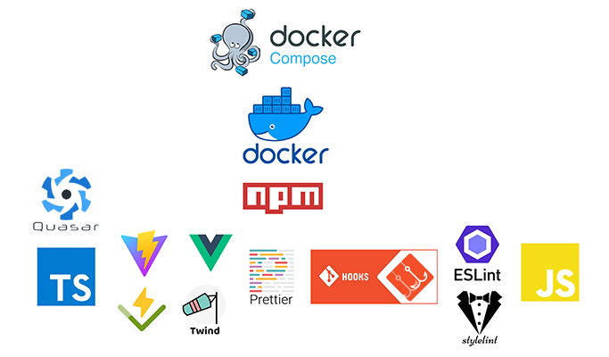

  

### Требования

- `npm i -g lint-staged`

### Установка

- `git clone <url> -b <branch-name>`
- `npm i && npm run prepare`

### Запуск

- `npm run dev` (`http://localhost:4444`)

### Docker

Docker использует nginx, поэтому если необходимо изменить порт который будет слушать Docker в nginx, то:

- Необходимо поправить порт в `docker/production/nginx.conf` (`server.listen <port>`) на необходимый;
- Поправить порт в `docker/production/Dockerfile` (`ENV PORT <port>`) на необходимый;
- Поправить порт в `docker/production/docker-compose.yml` на необходимый;

#### Docker compose dev (hot reload)

- `docker-compose -f docker/development/docker-compose.yml up --build` - старт (`http://localhost:4445`)
- `docker-compose -f docker/development/docker-compose.yml down` - стоп

#### Docker compose

- `docker-compose -f docker/production/docker-compose.yml up --build -d` - старт (`http://localhost:80`)
- `docker-compose -f docker/production/docker-compose.yml down` - стоп

### История инициализации

- `npm create vite@latest vue-xzdwq -- --template vue-ts`
